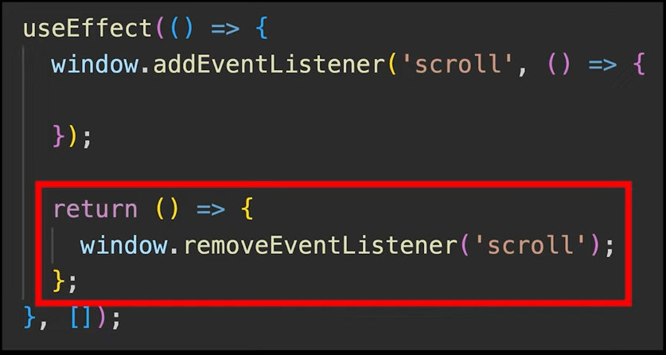
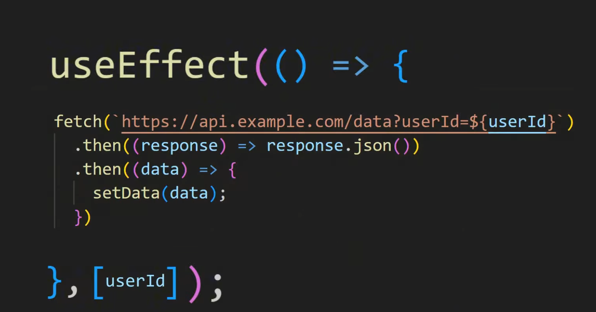

# React
- It is an external library that helps us create websites easier.
- `ReactDOM.createRoot(container)`: This basically sets up the root, and to set it up we have to give it an HTML element.
- `.render()`: Displays the output for the HTML element.
- In React, we can create our own React components.
- In React, we should not modify the data directly. We should make a copy of it and then use it.
- In React,  we use className to set a class

---

## To Generate the HTML in React 
- There are Several steps:-
  - ***Save The Data***

---

## What is Babel?
- It is a JavaScript compiler that translates other languages into JavaScript.
- `<script type="text/babel">`: This helps convert the HTML to JavaScript.

---

## JSX
- JavaScript XML.
- Similar to JavaScript, but allows us to write HTML directly in our JavaScript code.

---

## Creating Elements

### Single div
```javascript
const div = <div></div>;
```

### Multiple elements in a single div
```javascript
const div = 
  <div>
    <button>hello</button>
    <p>Goodbye</p>
  </div>
```

---

## Component
- It is a piece of the website.
- Component name should start with a **capital letter**.
- Function structure:
  ```javascript
  function Component() {
    // JavaScript logic here

    return (
      // JSX (HTML + JS expressions)
    );
  }
  ```
- In JSX, everything needs a closing tag like `<input></input>`, so the shortcut for this is `<input />`.
- In the *return*, when we return more than 1 element, it shows an error. To fix this, we can wrap them in a *div*.
- There are 2 ways to insert a component: `{ChatInput()}` and `<ChatInput></ChatInput>`.
- `<Fragment></Fragment>` or `<></>`: Both help us group multiple elements together.
- Every component function receives one parameter.

### Props
- Props is an object.
- It's short for "properties".
- It makes the code reusable.
- Destructuring shortcut:
  ```javascript
  const message = props.message;
  const sender = props.sender;
  ```
  
  **to**
  
  ```javascript
  const {message, sender} = props;
  ```

### Guard Operator (&&)
```javascript
const result = value1 && value2;
```
- If `value1` is true, then the result will be `value2`.
- This works like an if-statement.
- This allows us to insert conditional logic directly into JSX.

---

## Event Handlers
- Runs a function when we interact with the website.
- `.push()`: Adds a value to the end of the array.
- `crypto.randomUUID()`: It will create a random ID.
- Examples:
  - `onClick()`: Runs when clicking an element
  - `onChange()`: Runs when we change the text inside an `<input>`

### Event Object
- Event is an object.
- `event.target.value`: Gives us the value of the element that we are typing in.
  - `event.` — the event object triggered by user interaction (e.g., typing, clicking)
  - `target.` — the DOM element that triggered the event
  - `value` — the current content/value of that input element

---

## State
- Data that is connected to the HTML.
- When we update this data, it will update the HTML.
- How to create state: `React.useState()` — this is also a ***hook***. 

### Spread Operator (...)
- Takes the values in an array and copies them into a new array.

### Lifting the State Up 
- Moving state from a child component to a parent component so multiple components can share and use the same data.


---

## Hooks
- Inserts React features into our component.
- Every hook starts with **use**.
- There are 3 main Hooks:
  - `useEffect()` — runs some code after the component is updated or created.
    - Dependency Array = controls when useEffect runs.
    - The inner function of the `useEffect` should not return promise
    - It should only return nothing or cleanup function

      

    
  - `useRef()` — automatically saves an HTML element from the component.
    - ***ref*** is a container with special React features.
    


---

## Routes
- `<Routes></Routes>` — tells React all the pages that are in the website.
  - `<Route></Route>` — used to add a page to the website.
  - Route = Page.
    - `<Route path="/" element={<HomePage />}></Route>`
    - `path="/"` (should be lowercase) — defines the URL route (e.g., domain.com/)
    - `element={<HomePage />}` — specifies what component to display at that route
    - When a path is empty, we can use ***index*** in its place
- `<Link></Link>` — can be used in place of the ***a tag***. The `<a>` tag reloads the page, while the ***Link tag*** directly navigates without reloading. Use `to` instead of `href`.
- `<NavLink></NavLink>` — similar to `<Link>`, but useful for navigation links (links at the top of a page, usually in a header). It automatically applies an "active" class to the link when its route matches the current URL, making it easy to style the currently active navigation item.
 
---

## Axios
- It is a cleaner way to make request to the backend.
- It is a npm package 
- In place of `fetch` we can use `axios.get()`

---

## Async Await
- It is a better way to use the promise 
- To use `async await` in `useEffect()` we have to create a new function to use it
  - 